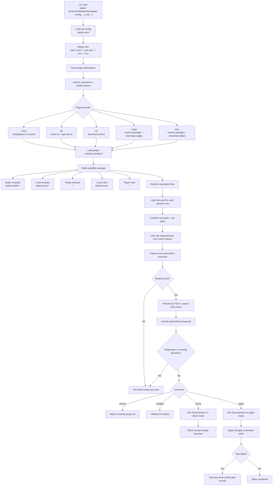

```mermaid
flowchart TD
    A["CLI start<br/>station {restore|validate|check|apply} --config ... [--set ...]"] --> B["Load root config<br/>station.yaml"]
    B --> C["Merge vars<br/>vars/*.yaml -> root vars -> env -> CLI"]
    C --> D["Parse plugin declarations"]
    D --> E["restore command or implicit restore"]

    E --> E1{"Plugin provider"}
    E1 --> E2["local<br/>root/plugins/<name>/ or archive"]
    E1 --> E3["git<br/>clone url + optional ref"]
    E1 --> E4["url<br/>download archive"]
    E1 --> E5["nuget<br/>resolve package + download nupkg"]
    E1 --> E6["npm<br/>resolve package + download tarball"]

    E2 --> F["Load plugin-manifest.yaml|yml"]
    E3 --> F
    E4 --> F
    E5 --> F
    E6 --> F

    F --> G["Build capability catalogs"]
    G --> G1["Builtin modules<br/>station.builtin.*"]
    G --> G2["Local modules<br/>station.local.*"]
    G --> G3["Plugin modules<br/><plugin-name>.*"]
    G --> G4["Local roles<br/>station.local.*"]
    G --> G5["Plugin roles<br/><plugin-name>.*"]

    G --> H["Resolve requested roles"]
    H --> I["Load role.yaml for each resolved role"]
    I --> J["Combine root tasks + role tasks"]
    J --> K["Infer role dependencies from used modules"]
    K --> L["Inspect every task before execution"]

    L --> L1{"Module found?"}
    L1 -- "No" --> X1["Fail before doing any work"]
    L1 -- "Yes" --> L2["Resolve by FQN or unique short name"]
    L2 --> L3["module.InspectAsync(request)"]
    L3 --> L4{"Diagnostics or missing elevation?"}
    L4 -- "Yes" --> X1
    L4 -- "No" --> M{"Command"}

    M -- "restore" --> S1["Report restored plugin set"]
    M -- "validate" --> S2["Validated N task(s)"]
    M -- "check" --> N["Run ExecuteAsync in check mode"]
    M -- "apply" --> O["Run ExecuteAsync in apply mode"]

    N --> P["Return would-change summary"]
    O --> Q["Apply changes in declared order"]
    Q --> R{"Task failed?"}
    R -- "Yes" --> X2["Stop and return partial task records"]
    R -- "No" --> S3["Apply completed"]
```
